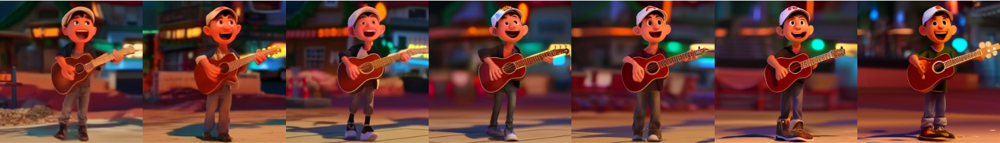
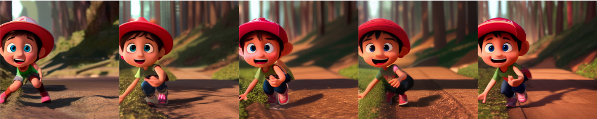
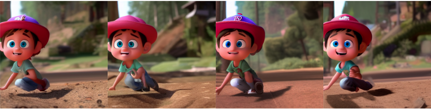
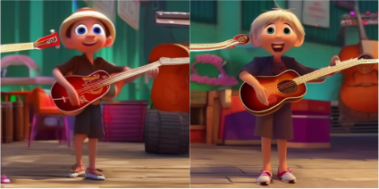
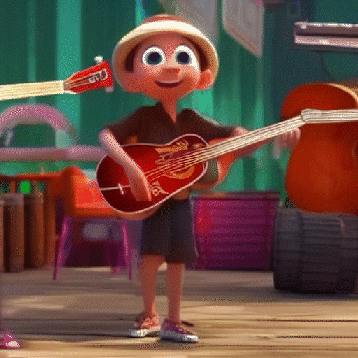

# DreamDance: Personalized Text-to-video Generation by Combining Text-to-Image Synthesis and Motion Transfer

## Results of Pipeline 2

Input images of prompt: miguel playing guitar on the street, pixar, cartoon, high quality, full body, single person

Output video

Input images of prompt: miguel running in a forest, pixar, cartoon, green eyes, red hat, high quality, standing, full body, single person

Output video

Input images of prompt: miguel in a forest, pixar, cartoon, green eyes, red hat, high quality, standing, full body, single person

Output video

Input images with prompt: miguel, pixar, cartoon, playing guitar, high quality, full body, single person

Output video

